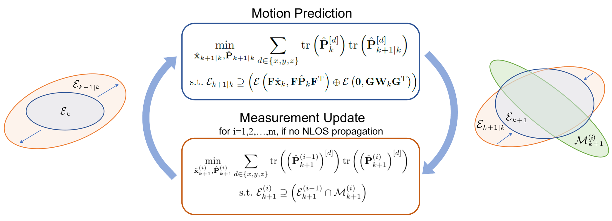

# [RA-L'25] Safety-Critical Ultra-Wideband 3D Localization with Set-Membership Uncertainty Representation

## 1. System Overview



## 2. Prerequisites

### 2.1 Eigen3


### 2.2 G2O


## 3. Build
```
cd your_ros_ws
mkdir src
cd src
git clone https://github.com/Zhu-YQ/DB-SMF-UWB.git
cd ..
catkin_make
```


## 4. Run
```
source devel/setup.bash
roslaunch db_smf_uwb run_sim.launch
```


## 5. Citation
```
@ARTICLE{11081890,
  author={Zhou, Bo and Zhu, Yueqi and Rui, Chufan and Luo, Jiasheng and Pan, Yan},
  journal={IEEE Robotics and Automation Letters}, 
  title={Safety-Critical Ultra-Wideband 3D Localization With Set-Membership Uncertainty Representation}, 
  year={2025},
  volume={10},
  number={9},
  pages={8826-8833},
  keywords={Uncertainty;Location awareness;Filters;Safety;Measurement uncertainty;Three-dimensional displays;Noise;Gaussian distribution;Robot sensing systems;Estimation;Localization;range sensing;robot safety;ultra-wideband;set-membership filter},
  doi={10.1109/LRA.2025.3589806}}
```
